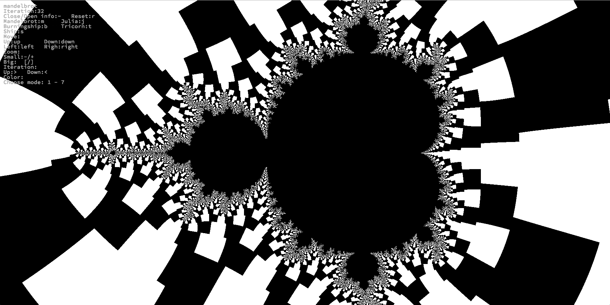
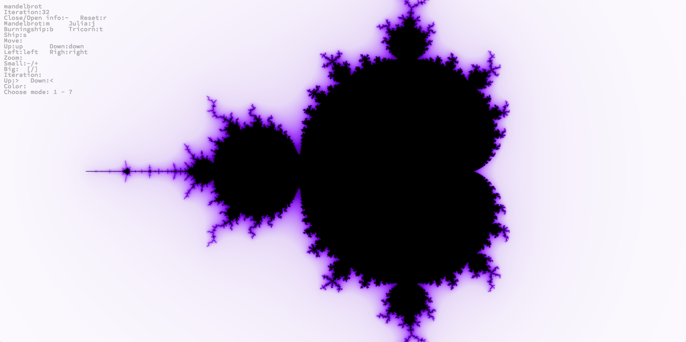
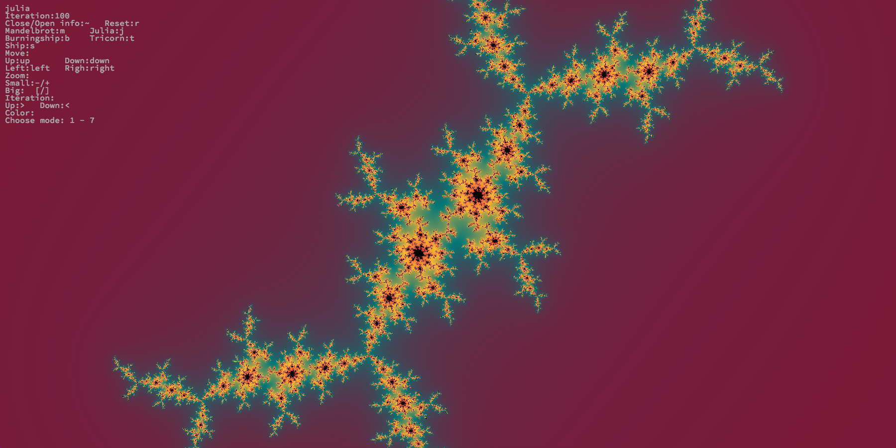
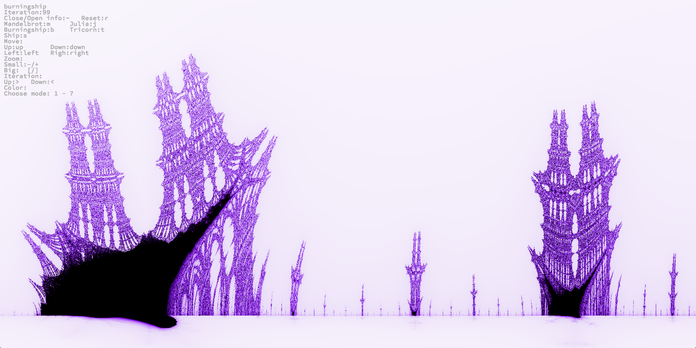

# Fract'ol - 42/Unit Factory

This project create program, which emulate fractals geometry.

This project work only MacOS system.
Used graphic "MiniLibX" library.

1. Use "make" to compile program.
2. run ./fractol

You may to use also mouse to moving and zooming.

# CONTROLS:

# Fractol:

'`M`' - Mandelbrot

'`J`' - Julia

'`B`' - Burnungship

'`T`' - Tricorn

'`S`' - Ship

# Move:

'`up`' - Up

'`down`' - Down

'`left`' - Left

'`right`' - Righ

# Zoom:

'`+`' or '`-`' - Small zoom

'`[`' or '`]`' - Big zoom

# Iteration:

'`>`' or '`<`' - Up/Down iter

# Color:

from '`1`' to '`7`' - Choose mode

#'`R`' - Reset

# '`esc`' - Exit
